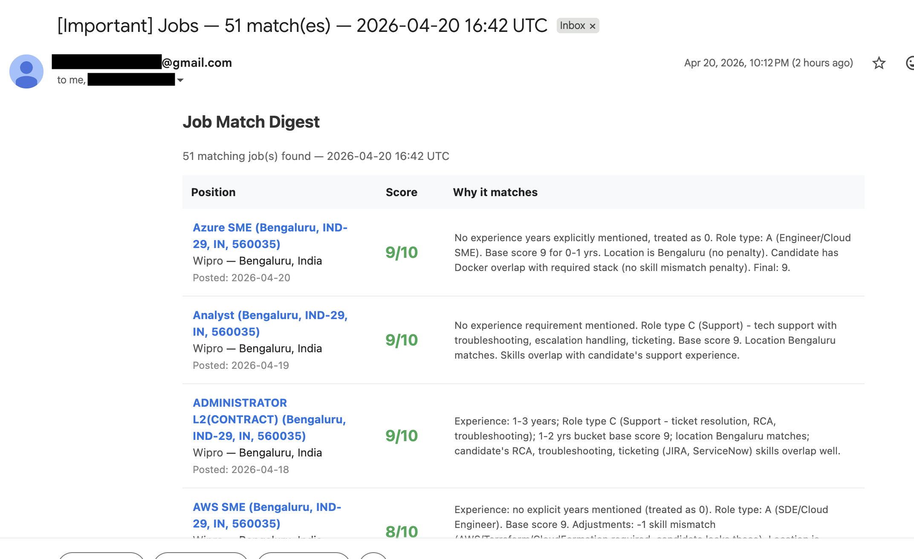
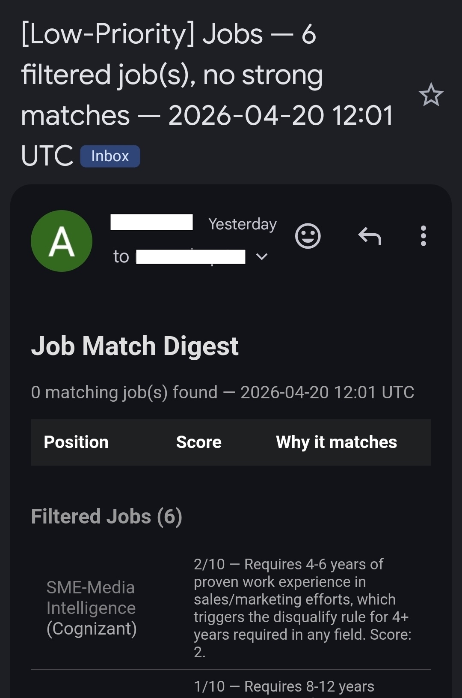

# Job Posting Watcher

A scheduled job scraper that monitors career portals (Workday, Amazon Jobs, Visa Careers, Google Careers, Cognizant, HCLTech, SuccessFactors-based sites, and generic sites via Playwright), scores postings against your profile using an LLM, deduplicates via SQLite, and sends HTML digest emails through Gmail.

## Email Digest Preview

<table>
  <tr>
    <td align="center">
      
      <br/>
      <em>Desktop — high-match digest with LLM scores and reasoning</em>
    </td>
    <td align="center">
      
      <br/>
      <em>Mobile — low-priority filtered digest</em>
    </td>
  </tr>
</table>

## How It Works

1. Reads your profile, skills, and scoring rubric from `config/config.yaml`
2. Scrapes job portals listed in `config/urls.yaml` on a schedule
3. Filters out already-seen jobs using a local SQLite database
4. Sends new jobs to an LLM (via a GenAI gateway) to score relevance (1-10)
5. Emails you an HTML digest of matching jobs through Gmail API

## Supported Scrapers

| Type | How It Works | Browser Needed? |
|------|-------------|-----------------|
| **Workday** | Direct HTTP POST to Workday's hidden JSON API. Paginates in chunks of 20. | No |
| **Amazon** | GET requests to Amazon Jobs' public JSON search API. Full descriptions inline. | No |
| **Visa** | Direct HTTP POST to Visa's backend jobs API. Full descriptions inline. | No |
| **Google** | POST to Google Careers' internal batchexecute RPC API. Paginates 20/page. | No |
| **Cognizant** | Parses Cognizant's public XML/RSS feed. Filters by city after parsing. | No |
| **SuccessFactors** | RSS feed scraper for SAP SuccessFactors-powered sites (Wipro, Capgemini, etc.). | No |
| **HCL** | JSON API for HCLTech's SuccessFactors instance (RSS doesn't support location filtering). | No |
| **Generic** | Playwright headless Chromium — scrolls page and finds job links via CSS selectors. | Yes |

## Prerequisites

- Python 3.11+
- A GenAI gateway (OpenAI-compatible API) with authentication credentials
- A Google Cloud project with Gmail API enabled (for email notifications)
- (Optional) Playwright + Chromium for generic scraper

## Setup

### 1. Clone and create virtual environment

```bash
git clone <repo-url>
cd jobscrapper
python -m venv .venv
source .venv/bin/activate
pip install -r requirements.txt
```

### 2. Install Playwright (optional, for generic scraper)

```bash
playwright install chromium
```

### 3. Configure `config/config.yaml`

Copy the template below and fill in your details:

```yaml
profiles:
  - title: "Your Target Role Title"
    skills:
      - Python
      - Java
      # ... your skills
    tools:
      - Git
      - Docker
      # ... your tools
    experience_years: 2
    location_preference: "Your City; Remote"
    additional_criteria: |
      Describe what roles you're looking for and any preferences.

scoring_instructions: |
  Instructions for the LLM on how to score jobs against your profile.
  Include your resume summary, disqualification criteria, role classification,
  and scoring rubric. See config.yaml for the full format.

genai:
  login_url: "https://your-genai-gateway.com/auth/login"
  validate_url: "https://your-genai-gateway.com/auth/validate"
  chat_url: "https://your-genai-gateway.com/queries/chat"
  username: "your_service_account"
  password: "base64_encoded_password"       # base64-encoded
  model: "claude-opus-4-6"                  # or any OpenAI-compatible model
  application_name: "job-posting-watcher"
  match_threshold: 3                        # 1-10, only notify if score >= this

email:
  sender_email: "your-sender@gmail.com"
  recipient_email: "you@gmail.com, teammate@gmail.com"  # comma-separated for multiple
  digest_mode: "aggregated"  # "per_company" or "aggregated"

schedule:
  interval_minutes: 60
  delay_between_sites_seconds: 5

workday:
  max_age_days: 2  # Skip jobs older than this

amazon:
  max_age_days: 2

visa:
  max_age_days: 3

google:
  max_age_days: 7  # Google Careers job age filter

cognizant:
  cities:  # Filter XML feed to these cities
    - Bangalore
    - Hyderabad

hcl:
  max_age_days: 7
```

**Key fields:**

- **`genai`**: Your LLM gateway credentials. The app authenticates via `login_url` (POST with username/password) to get a JWT token, then sends scoring prompts to `chat_url`. The password should be base64-encoded.
- **`email`**: Gmail addresses for sending/receiving digests. Supports multiple comma-separated recipients.
- **`match_threshold`**: Minimum LLM score (1-10) to include a job in the email. Lower = more jobs.
- **`scoring_instructions`**: The full prompt sent to the LLM with your resume, disqualification rules, and scoring rubric.

### 4. Configure `config/urls.yaml`

Add career portals to monitor, one per line in the format `scraper_type | URL`:

```
# Workday portals
workday | https://company.wd5.myworkdayjobs.com/en-US/External

# Amazon Jobs (filters via query params)
amazon | https://www.amazon.jobs/en/search.json?normalized_country_code[]=IND&loc_query=Bangalore+India&sort=recent&result_limit=100

# Visa Jobs (Bangalore only)
visa | https://corporate.visa.com/en/jobs/?cities=Bangalore

# Google Careers
google | https://www.google.com/about/careers/applications/jobs/results?location=Bangalore+India

# Cognizant XML feed
cognizant | https://careers.cognizant.com/india-en/jobs/xml/?rss=true

# SuccessFactors RSS (Wipro, Capgemini, etc.)
successfactors | https://wipro.eightfold.ai/services/rss/job/?locale=en_US

# HCLTech JSON API
hcl | https://careers.hcltech.com/

# Generic sites (requires Playwright)
generic | https://careers.example.com/jobs/
```

Lines starting with `#` are comments. This file is re-read every cycle, so you can add/remove URLs without restarting.

### 5. Set up Gmail API credentials

The app sends emails via Gmail API (not SMTP), which works through corporate firewalls.

1. Go to [Google Cloud Console](https://console.cloud.google.com/)
2. Create a new project (or use an existing one)
3. Enable the **Gmail API**
4. Go to **Credentials** > **Create Credentials** > **OAuth 2.0 Client ID**
5. Choose **Desktop application** as the application type
6. Download the JSON file and save it as `data/credentials.json`
7. On first run, a browser window will open for OAuth consent — authorize with the Gmail account matching `sender_email`
8. After authorization, `data/token.json` is created automatically (no browser needed on subsequent runs)

### 6. (Optional) Configure Workday location facets

To filter Workday jobs by location, generate location facets:

```bash
python scripts/discover_locations.py
```

This creates `config/workday_locations.yaml` with per-portal location IDs used to filter jobs by region.

**After running the script, manually review the YAML for false positives.** The `\bindia\b` word-boundary pattern in the script catches entries like "Chennai, India" or "Mumbai, India" that aren't in your target cities. Remove any locations that don't match your desired cities (currently Bangalore/Hyderabad only).

## Running

```bash
source .venv/bin/activate
python main.py
```

The app will:
1. Run the first scrape cycle immediately
2. Then repeat every `interval_minutes` (default: 60 minutes)
3. Press `Ctrl+C` to stop gracefully

## Project Structure

```
jobscrapper/
├── main.py                  # Entry point — scheduler loop
├── config/
│   ├── __init__.py
│   ├── loader.py            # Reads config.yaml and urls.yaml
│   ├── config.yaml          # Your profiles, credentials, scoring rules
│   ├── urls.yaml            # Career portal URLs to monitor
│   └── workday_locations.yaml  # (generated) Location facets for Workday
├── scrapers/
│   ├── __init__.py          # Scraper registry and factory
│   ├── base.py              # JobPosting dataclass and BaseScraper interface
│   ├── workday.py           # Workday JSON API scraper
│   ├── amazon.py            # Amazon Jobs JSON API scraper
│   ├── visa.py              # Visa Careers backend API scraper
│   ├── google.py            # Google Careers batchexecute RPC scraper
│   ├── cognizant.py         # Cognizant XML/RSS feed scraper
│   ├── successfactors.py    # SAP SuccessFactors RSS scraper (Wipro, Capgemini, etc.)
│   ├── hcl.py               # HCLTech SuccessFactors JSON API scraper
│   └── generic.py           # Playwright-based fallback scraper
├── services/
│   ├── db.py                # SQLite deduplication store
│   ├── genai_client.py      # GenAI gateway HTTP client (auth + retry)
│   ├── matcher.py           # LLM job scoring logic
│   └── notifier.py          # Gmail API email sender
├── scripts/
│   └── discover_locations.py  # Workday location facet discovery
├── data/                    # Runtime data (gitignored)
│   ├── credentials.json     # Google OAuth2 client credentials (YOU provide)
│   ├── token.json           # Auto-created after OAuth consent
│   └── jobs.db              # SQLite database (auto-created)
├── tests/
├── requirements.txt
└── .gitignore
```

## Adding a New Scraper

1. Create a new file in `scrapers/` (e.g., `scrapers/greenhouse.py`)
2. Create a class inheriting from `BaseScraper` and implement `scrape(url) -> list[JobPosting]`
3. Import and register it in `scrapers/__init__.py`:
   ```python
   from scrapers.greenhouse import GreenhouseScraper
   SCRAPER_REGISTRY["greenhouse"] = GreenhouseScraper
   ```
4. Add URLs to `config/urls.yaml`:
   ```
   greenhouse | https://boards.greenhouse.io/company
   ```

## Running Tests

```bash
# Run all tests
pytest tests/

# Skip integration tests (no network/email)
SKIP_INTEGRATION=1 pytest tests/

# Run a single test file
pytest tests/test_matcher.py
```

## Notes

- SSL verification is disabled in HTTP clients (`verify=False`) to work behind corporate HTTPS-intercepting proxies (e.g., Zscaler). Remove this if you're not behind such a proxy.
- Job descriptions are lazy-fetched: only new (unseen) jobs get enriched, saving API calls.
- The GenAI client includes exponential backoff retry logic (up to 10 retries) and automatic token refresh on 401.
- `config/urls.yaml` is re-read every cycle — add or remove URLs without restarting the app.
